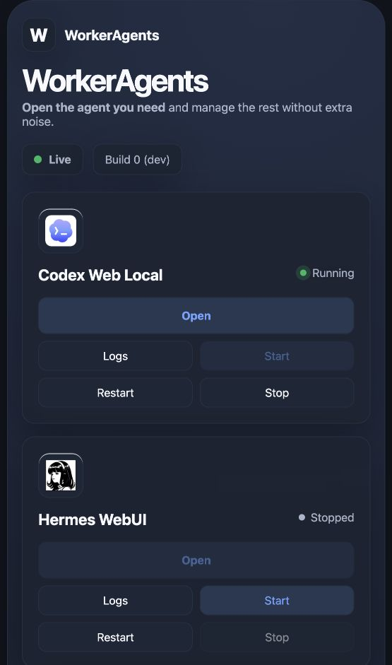

<div align="center">

# 🤖 Worker Agents

### One dashboard. Many agents. Zero terminal-tab archaeology. 🚀

[](https://nodejs.org/)
[](Dockerfile)
[](#-quick-start)
[](https://github.com/OpenWebAgents/workerAgents/stargazers)

> **Your AI agents demanded a mission-control room.**
> **We gave them buttons, logs, health states, and just enough supervision to look responsible.**

```text
╔══════════════════════════════════════════════════╗
║  AGENTS: CHAOTIC    DASHBOARD: CALM    VIBE: ✅  ║
╚══════════════════════════════════════════════════╝
```

</div>

---

## 📸 Mission Control, Caught in the Act

<div align="center">



<sub>Real dashboard. Real runtime states. No actors were paid, although several agents requested API credits.</sub>

</div>

---

## 🧠 TL;DR

Worker Agents is a local Node.js control plane for launching and supervising agent UIs from one browser dashboard. It tracks ports, processes, URLs, logs, errors, and status so you can stop asking, “Wait… which terminal was OpenClaw in?”

Yes, it launches agents. Yes, it has a File Browser and Web VNC. **Yes, the stop button actually stops things.**

## 🤯 What Can It Herd?

| 🎭 Suspect | 🛠️ What Worker Agents does |
|---|---|
| 🧠 Codex Web Local | Launches and watches the local UI |
| 🐙 OpenCode | Starts the web server and captures runtime output |
| 🦞 OpenClaw | Runs the gateway behind a same-origin proxy |
| 🧙 Hermes WebUI | Boots the gateway and web interface |
| 🧪 9Router | Installs, starts, checks, and reports the router |
| 🕵️ Agent Zero | Prepares its environment and supervises the UI |
| 📁 File Browser | Browses and edits files from the dashboard |
| 🖥️ Web VNC | Provides a browser-accessible desktop |
| 🧩 Your worker | Loads custom commands from `workers.json` |

## ⚡ Quick Start

```bash
# 🔓 Install the exact lockfile-owned runtime and validate it
npm ci
npm run self-check
npm start
```

Open [http://127.0.0.1:1456](http://127.0.0.1:1456). Congratulations: your terminal tabs may now unionize in peace.

Worker Agents requires Node.js 22 or newer. `npm ci` installs the pinned local
`9router-vibefin` package and runs its deterministic preparation hook.
`npm run self-check` fails before startup when Node, the lockfile, the installed
router, or the prepared middleware has drifted. Runtime `setup.js` repeats these
checks and reports failures; it intentionally does not invoke privileged host
deployment scripts or rewrite the running checkout.

Override the port when `1456` has already been claimed by mysterious forces:

```bash
PORT=3000 npm start
```

## 🐳 Docker: Put the Chaos in a Box

> **One script to build it, run it, and wait until it proves it has a pulse.**

```bash
./scripts/docker-run.sh
```

The script builds `worker-agents:local`, starts a `worker-agents` container, publishes only the dashboard port, persists state in a named volume, and waits for the `/api/status` health check. Local Open actions use stable agent subdomains such as `codex.localhost:1456` and `web-vnc.localhost:1456`; Worker Agents routes them to private container ports. Customize it with:

```bash
WORKER_AGENTS_PORT=3000 \
WORKER_AGENTS_IMAGE=my-worker-agents:latest \
WORKER_AGENTS_CONTAINER=my-worker-agents \
./scripts/docker-run.sh
```

## 🪟 Windows: PowerShell, but Make It Helpful

```powershell
powershell -ExecutionPolicy Bypass -File .\scripts\start-windows.ps1
```

The launcher checks Node.js 20+, npm, Git, Git Bash, and Python. If `winget` is available, it can install missing prerequisites instead of merely judging you.

Clean-start aliases are available when a runtime has achieved haunted-house status:

```powershell
npm run start:windows:clean-9router
npm run start:windows:clean-opencode
npm run start:windows:clean-all
```

## 🧩 Add Your Own Worker

Create a local `workers.json` file:

```json
[
  {
    "id": "my-agent",
    "name": "My Suspiciously Productive Agent",
    "basePort": 19050,
    "path": "/",
    "command": "my-agent-web --host 127.0.0.1 --port {port}",
    "readyPatterns": ["listening", "http://127.0.0.1:"]
  }
]
```

`{port}` becomes an available port beginning at `basePort`. Restart the console, press Start, and pretend this was always the plan.

## 🏗️ How the Circus Is Arranged

```text
Browser dashboard
       │ actions + status + logs
       ▼
Node.js control plane ─────► process supervisor
       │                           │
       ├──► auth and setup         ├──► agent commands
       ├──► HTTP/WS proxies        ├──► ports and PIDs
       └──► persisted state        └──► runtime output
```

```text
.
├── src/          # 🧠 Server, setup, auth, routing, supervision
├── public/       # 🎛️ Browser mission control
├── filebrowser/  # 📁 Built-in filesystem explorer
├── scripts/      # 🔧 Windows, Docker, and publishing helpers
├── wiki/         # 📚 Operational notes
└── Dockerfile    # 🐳 Portable containment field
```

## 🎯 Requirements

- 🟢 **Node.js 20+** for local operation
- 🐳 **Docker** for container operation
- 🧰 Agent-specific tools only for the agents you choose to launch
- ☕ A beverage for watching install logs scroll dramatically

## 🐛 Troubleshooting

| 😱 Problem | 🧯 Fix |
|---|---|
| Port `1456` is busy | Run with `PORT=3000 npm start` |
| 9Router remembers a past life | Run `npm run start:clean-9router` |
| OpenCode needs a clean entrance | Run `npm run start:clean-opencode` |
| Everything feels cursed | Run `npm run start:clean-all` |
| Docker container looks sad | Run `docker logs worker-agents` |

## 🤝 Contributing

Issues and pull requests are welcome. Bring a reproducible bug, a useful agent preset, or a meme strong enough to survive code review.

## ⭐ Star This Repo

If you believe AI agents deserve a proper control room instead of twelve terminals and a sticky note, **smash that star button**. ⭐

<div align="center">

**Built with Node.js, questionable optimism, and process IDs.** 🔬

*The agents are supervised. The humans remain an open issue.* 😏

</div>
